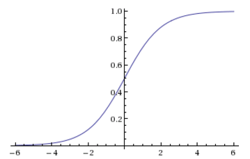

泰坦尼克号获救预测
====

## 1. 数据准备
- [titanic_train.csv](titanic_train.csv)
- 数据预处理
    ```
        import pandas as pd
        
        titanic = pd.read_csv('titanic_train.csv')
        print titanic.describe()
    ```
    Output ==>
    ```
              PassengerId    Survived      Pclass         Age       SibSp  \
    count   891.000000    891.000000  891.000000  714.000000  891.000000   
    mean    446.000000    0.383838    2.308642   29.699118    0.523008   
    std     257.353842    0.486592    0.836071   14.526497    1.102743   
    min       1.000000    0.000000    1.000000    0.420000    0.000000   
    25%     223.500000    0.000000    2.000000   20.125000    0.000000   
    50%     446.000000    0.000000    3.000000   28.000000    0.000000   
    75%     668.500000    1.000000    3.000000   38.000000    1.000000   
    max     891.000000    1.000000    3.000000   80.000000    8.000000   
    
                Parch        Fare  
    count  891.000000  891.000000  
    mean     0.381594   32.204208  
    std      0.806057   49.693429  
    min      0.000000    0.000000  
    25%      0.000000    7.910400  
    50%      0.000000   14.454200  
    75%      0.000000   31.000000  
    max      6.000000  512.329200 
    ```
    
    可以看到  **Age** 的样本个数为714个，而PassengerId及其它的都是 891个样本，所以首先需要对**Age**进行处理
    ```
    # 用Age的均值进行填充
    titanic['Age'] = titanic['Age'].fillna(titanic['Age'].median())
    print titanic.describe()
    ```
    Output ==>
    ```
               PassengerId    Survived      Pclass         Age       SibSp  \
    count   891.000000  891.000000  891.000000  891.000000  891.000000   
    mean    446.000000    0.383838    2.308642   29.361582    0.523008   
    std     257.353842    0.486592    0.836071   13.019697    1.102743   
    min       1.000000    0.000000    1.000000    0.420000    0.000000   
    25%     223.500000    0.000000    2.000000   22.000000    0.000000   
    50%     446.000000    0.000000    3.000000   28.000000    0.000000   
    75%     668.500000    1.000000    3.000000   35.000000    1.000000   
    max     891.000000    1.000000    3.000000   80.000000    8.000000   
    
                Parch        Fare  
    count  891.000000  891.000000  
    mean     0.381594   32.204208  
    std      0.806057   49.693429  
    min      0.000000    0.000000  
    25%      0.000000    7.910400  
    50%      0.000000   14.454200  
    75%      0.000000   31.000000  
    max      6.000000  512.329200 
    ```
    
    可以看到  **Age**的样本数量也是 891了!
    
    
## Cross-Validation 交叉验证
    我的理解是: 假如一个样本有 100份数据，其中我们将10%(即10份)作为 "测试" 数据集, 另外 90% (90份) 作为 "训练" 数据集 
    则 『交叉验证』就是将 "90份训练数据集" 再分成几份，如果分成3份，我们标记为 A, B, C
    +-----------------------------------+-----------------+
    |     A     |     B      |     C    |        Test     |     
    +-----------------------------------+-----------------+
    则 "交叉验证" 就会将 A, B, C两两组合，而用另一个来验证, 如:
    
    +------------------+------+--------------------+
    A 与 B 组合 进行训练  ----> 用 C 作为 Label来验证
    A 与 C 组合 进行训练  ----> 用 B 作为 Label来验证
    B 与 C 组合 进行训练  ----> 用 A 作为 Label来验证
    +------------------+------+--------------------+

[请参见博文 交叉验证详解](http://blog.csdn.net/jasonding1354/article/details/50562513)    
    

## LinearRegression 线性回归
- [关于 线性回归 请参见这篇博文](http://blog.csdn.net/github_36326955/article/details/60462778)
- 知识点 
    - sigmod 函数 输出是值是介于 0~1之间的 [0,1]区间上, 函数图像为:
    
    
## RandomForest 随机森林
- 1.选择样本随机
- 2.选择特征随机
- [sklearn 随机森林参数详解请参见博文](http://blog.csdn.net/CherDW/article/details/54971771)    
    - **max_features**: RF划分时考虑的最大特征数。可以使用很多种类型的值，__默认是"None",意味着划分时考虑所有的特征数__；如果是"log2"意味着划分时最多考虑log2N个特征；如果是"sqrt"或者"auto"意味着划分时最多考虑N−−√N个特征。如果是整数，代表考虑的特征绝对数。如果是浮点数，代表考虑特征百分比，即考虑（百分比xN）取整后的特征数，其中N为样本总特征数。一般来说，如果样本特征数不多，比如小于50，我们用默认的"None"就可以了，如果特征数非常多，我们可以灵活使用刚才描述的其他取值来控制划分时考虑的最大特征数，以控制决策树的生成时间。
    - **max_depth**: 决策树最大深度。默认为"None"，决策树在建立子树的时候不会限制子树的深度这样建树时，会使每一个叶节点只有一个类别，或是达到min_samples_split。一般来说，数据少或者特征少的时候可以不管这个值。如果模型样本量多，特征也多的情况下，推荐限制这个最大深度，具体的取值取决于数据的分布。__常用的可以取值10-100之间__。
    - **min_samples_split**: 内部节点再划分所需最小样本数，默认2。这个值限制了子树继续划分的条件，如果__某节点的样本数少于min_samples_split，则不会继续再尝试选择最优特征来进行划分__。 默认是2.如果样本量不大，不需要管这个值。如果样本量数量级非常大，则推荐增大这个值
    - **min_samples_leaf**: 叶子节点最少样本数。 这个值限制了叶子节点最少的样本数，如果某叶子节点数目小于样本数，则会和兄弟节点一起被剪枝。 默认是1,可以输入最少的样本数的整数，或者最少样本数占样本总数的百分比。如果样本量不大，不需要管这个值。如果样本量数量级非常大，则推荐增大这个值
    
    
    
## sklearn中 predict_proba返回值说明
    #测试样例：
    X_test = [
    [2,3,4,5]
    [3,4,5,6]
    ]
    #假设分类结果为可能为0，1两类
    model.predict_proba(X_test)=
    array([[0.1,0.9],   #代表[2,3,4,5]被判断为0的概率为0.1，被判断为1的概率为0.9
           [0.8,0.2]])  #代表[3,4,5,6]被判断为0的概率为0.8，被判断为1的概率为0.2
    

## Note
* [Click here to view the samples 示例](taitannike.ipynb)
* [也可以参见这个](https://github.com/highroom/Project/blob/master/taitannike.ipynb)    